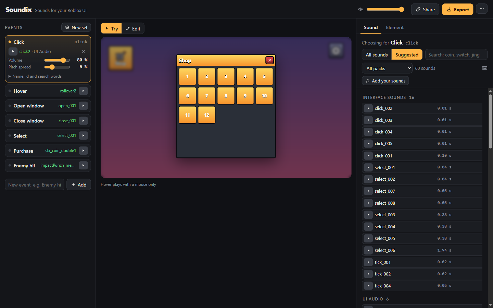

# Soundix

Pick the sounds of your Roblox game on a clickable wireframe and hand them to an agent.

**https://smaltra.github.io/soundix/**



- Sketch the game UI on a 16:9 canvas: buttons, windows with mock lists or grids, labels. Or give an agent the prompt from More → Prompt for an agent and import the JSON it writes.
- Add events, also ones outside the UI (enemy hit, level up), and pick a sound for each from 1372 CC0 sounds or your own files. Set volume and pitch spread.
- Nothing fits? Generate sounds on fal.ai or ElevenLabs with your own key (Library → Generate), up to 10 variants at once; pick one and come back to the others later.
- Hand your work to someone else: Export with all variants, and Import opens that ZIP whole, own sounds and variants included.
- Switch to Try and click through: hover and press buttons, open windows, pick items, hear every sound. Ctrl+Z / Cmd+Z undoes edits.
- Export a ZIP: sounds named after the events, `soundix.json` (events and the wireframe with element ids), `CREDITS.txt` and `AGENT.md`, the task for the agent that uploads the sounds and wires them into the game.
- Share the whole set as a link.

Everything runs in the browser: no server, no accounts, no analytics. Own sounds stay on your computer.

For agents: [`llms.txt`](public/llms.txt) describes the UI JSON, `soundix.json`, the library and the share link.

## Run locally

Needs Node 22+ and `ffmpeg`/`ffprobe` in `PATH`.

```bash
npm ci
npm run library   # builds public/library/ from packs/
npm run dev       # http://localhost:5173/soundix/
npm test          # core tests
npm run build
```

## Add a pack

1. Put the pack, as downloaded, with its licence file into `packs/<id>/`.
2. Add a row to `packs.json`: `id`, `name`, `author`, `url`, `license`.
3. Run `npm run library`.

Only CC0 sounds are accepted. Files with `preview` in the name, `__MACOSX` and hidden files are skipped. A top folder shared by every sound in a pack is left out of the ids.

## Licences

Code: [MIT](LICENSE). Sounds: CC0, by the pack authors:

| Pack | Author |
|---|---|
| [UI Audio](https://kenney.nl/assets/ui-audio), [Interface Sounds](https://kenney.nl/assets/interface-sounds), [RPG Audio](https://kenney.nl/assets/rpg-audio), [Casino Audio](https://kenney.nl/assets/casino-audio), [Digital Audio](https://kenney.nl/assets/digital-audio), [Impact Sounds](https://kenney.nl/assets/impact-sounds), [Music Jingles](https://kenney.nl/assets/music-jingles), [Sci-Fi Sounds](https://kenney.nl/assets/sci-fi-sounds), [Voiceover](https://kenney.nl/assets/voiceover-pack), [Voiceover Fighter](https://kenney.nl/assets/voiceover-pack-fighter) | Kenney |
| [RPG Sound Pack](https://opengameart.org/content/rpg-sound-pack) | artisticdude |
| [512 Retro (8-bit)](https://opengameart.org/content/512-sound-effects-8-bit-style) | Juhani Junkala |
| [Level Up 13](https://opengameart.org/content/level-up-power-up-coin-get-13-sounds) | wobbleboxx |
| [Menu 7](https://opengameart.org/content/7-assorted-sound-effects-menu-level-up) | Joth |
